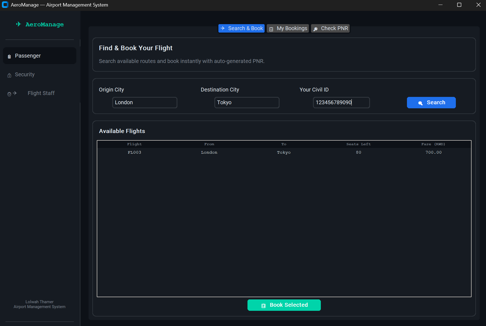
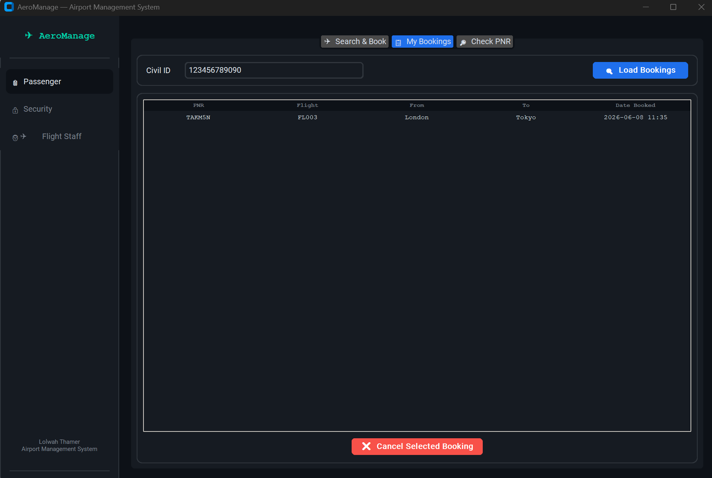
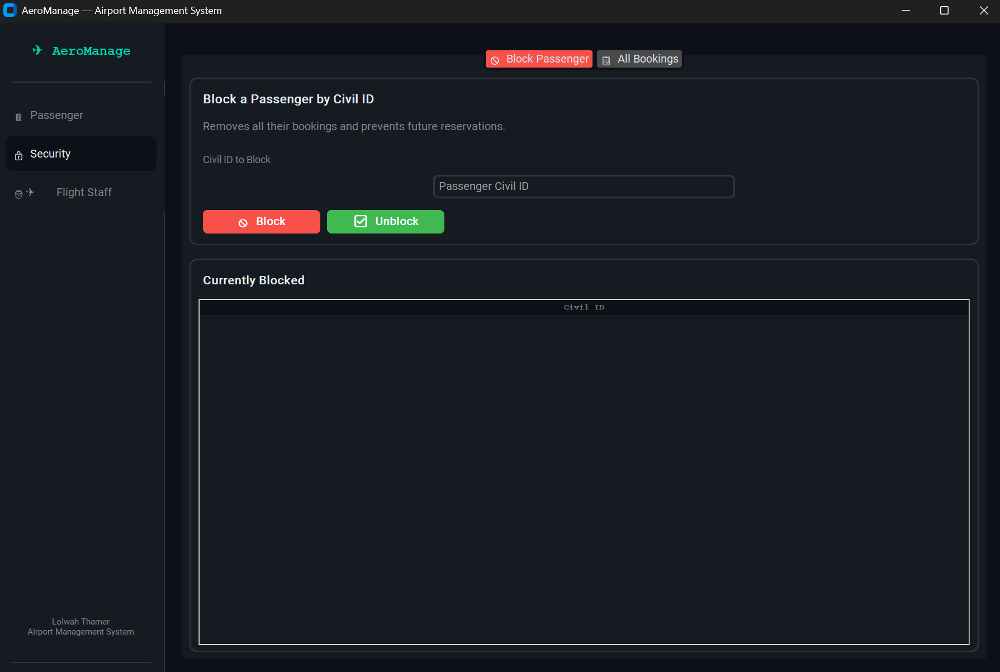
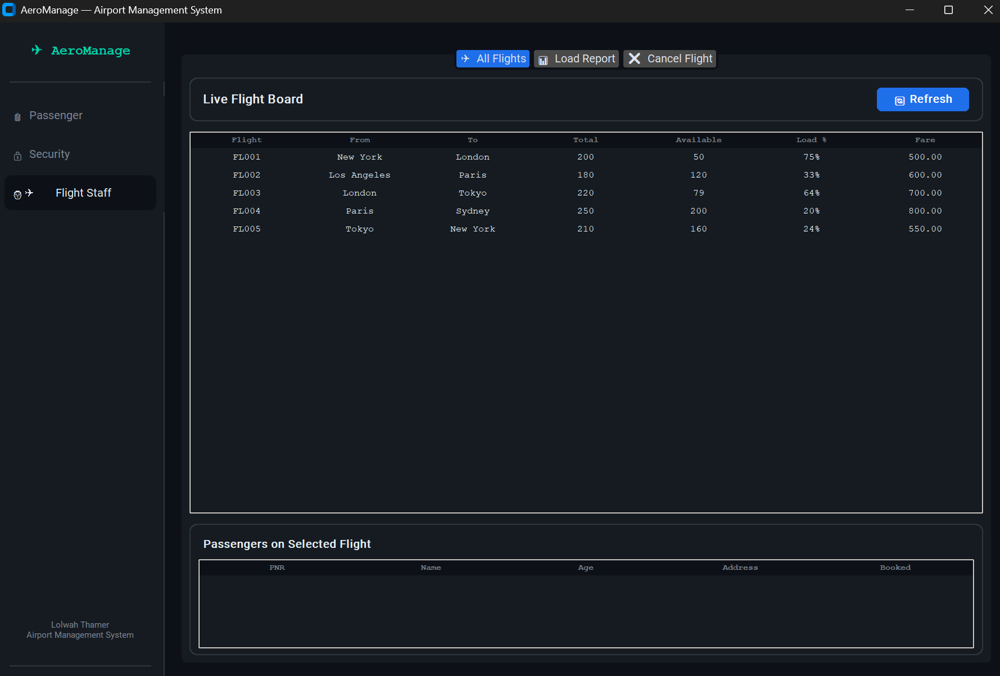

# ✈ AeroManage – Airport Management System

A complete desktop application for airport operations, built with **Python**, **CustomTkinter**, and **SQLite**.  
Implements three role‑based portals: **Passenger**, **Security**, and **Flight Staff**.

---

## 📑 Table of Contents
- [System Overview](#system-overview)
- [Class Diagram](#class-diagram)
- [Database Schema](#database-schema)
- [Workflow Diagrams](#workflow-diagrams)
  - [Passenger Booking Flow](#passenger-booking-flow)
  - [Security Block Passenger Flow](#security-block-passenger-flow)
  - [Flight Staff Load Report Flow](#flight-staff-load-report-flow)
  - [Full System Interaction (Sequence)](#full-system-interaction-sequence)
- [GUI Screenshots](#gui-screenshots)
- [Features](#features)
- [Installation & Setup](#installation--setup)
- [Default Credentials](#default-credentials)
- [Usage Guide](#usage-guide)
- [Project Structure](#project-structure)
- [Future Enhancements](#future-enhancements)
- [References](#references)

---

## System Overview

AeroManage is a **three‑tier** application that separates user interface, business logic, and data persistence.

1. **Presentation Layer** – Built with CustomTkinter, providing a modern dark‑theme GUI. The main window contains a sidebar for navigation and a dynamic content area that switches between three portals: Passenger, Security, and Flight Staff.

2. **Business Logic Layer** – Implemented as Python classes (`Passenger`, `Flight`, `Staff`, `Security`). These classes encapsulate all the rules: checking if a passenger is blocked, validating seat availability, generating PNR codes, updating seat counts, and generating load reports. The `Security` class inherits from `Staff` and extends functionality for blocking/unblocking passengers.

3. **Data Access Layer** – A thin `Database` wrapper around SQLite. It handles connection management, executes queries, and commits transactions. On first run, it reads three text files (`data.txt`, `flight.txt`, `booking.txt`) and populates the database with initial data.

The application uses a **thread‑safe** SQLite connection (`check_same_thread=False`) because the GUI runs in the main thread and database operations are called directly from event handlers. No heavy background threads are needed, so the UI remains responsive.

---

## Class Diagram

The core domain model uses inheritance and composition. The diagram below shows the relationships between the main classes.

**Explanation of the class diagram:**
- `Database` is a low‑level helper that provides `q()` (query) and `run()` (execute) methods. All other classes receive a `Database` instance.
- `Staff` stores civil_id, name, and role. Its static method `authenticate()` verifies credentials against the `staff` table.
- `Security` inherits from `Staff` and adds `block_passenger()` and `unblock_passenger()`. These methods insert/delete from the `blocked` table and also remove all bookings of that passenger when blocking.
- `Passenger` represents a traveller. It checks the `blocked` table before booking, and its `book_flight()` method both inserts a booking and decrements the available seats in a single transaction.
- `Flight` contains only static methods that operate on the database – searching flights, retrieving all flights, listing passengers on a flight, cancelling a flight (which deletes its bookings and the flight record), and generating the load report (flights with >50% occupancy).

This design keeps the database logic centralized, while business rules live inside the classes, making the code easy to test and extend.

---

## Database Schema

The SQLite database `aero.db` contains four tables. The schema is created automatically by the `Database._init()` method.

| Table       | Columns                                                                 |
|-------------|-------------------------------------------------------------------------|
| **staff**   | civil_id (PK), name, role, password                                     |
| **flights** | flight_number (PK), origin, destination, total_seats, available_seats, fare |
| **bookings**| pnr (PK), flight_number, origin, destination, civil_id, passenger_name, passenger_age, passenger_address, booked_at |
| **blocked** | civil_id (PK)                                                           |

**Important constraints and logic:**
- `flights.available_seats` is updated atomically: on booking it is decreased by 1, on cancellation it is increased by 1. This ensures consistency even if multiple bookings happen simultaneously (SQLite handles transactions).
- The `blocked` table stores only the Civil IDs of banned passengers. When a passenger is blocked, the system also deletes all their existing bookings (cascade effect).
- `bookings.booked_at` stores a timestamp in the format `YYYY-MM-DD HH:MM`, generated by `datetime.now()`.
- There is no foreign key constraint between `bookings` and `flights` in the schema to keep it simple, but the application logic ensures referential integrity.

---

## Workflow Diagrams

The following diagrams illustrate the core workflows of the system. Each diagram corresponds to a key user action.

### Passenger Booking Flow

This flowchart shows the complete journey of a passenger booking a flight. After entering origin, destination, and Civil ID, the system searches for available flights. If flights are found, the passenger selects one and provides name, age, and address. Then two critical checks happen:
1. **Is the passenger blocked?** – If yes, a `PermissionError` is raised.
2. **Are seats available?** – If no, a `ValueError` is raised.

If both checks pass, the system generates a random 6‑character alphanumeric PNR, inserts the booking record, decrements the available seats, and finally shows the PNR to the passenger.

### Security Block Passenger Flow

A security officer first logs into the Security Portal. After entering the Civil ID of the passenger to block, the system performs two database operations inside a transaction:
- Insert the Civil ID into the `blocked` table.
- Delete all bookings for that Civil ID from the `bookings` table.

After these operations, the UI refreshes both the blocked list and the “all bookings” view. From that moment onward, the blocked passenger cannot book any flight (the `Passenger.is_blocked()` check will return `True`).

### Flight Staff Load Report Flow

Flight staff can generate a report that lists all flights with occupancy exceeding 50%. The system queries all flights from the database, then for each flight calculates the load percentage as `(total_seats - available_seats) / total_seats * 100`. If the value is greater than 50, the flight is added to the report. Finally, the report is displayed in a treeview widget. This helps staff identify popular routes and plan capacity adjustments.

### Full System Interaction (Sequence)

.png)

The sequence diagram shows how the GUI, business logic, and database interact over time for a booking attempt. It includes three alternative scenarios:
- **Successful booking** (seats available and passenger not blocked): the database returns success, and the GUI shows a confirmation message with the PNR.
- **Blocked passenger**: the business logic raises `PermissionError`, which the GUI catches and displays as a toast error.
- **No seats**: a `ValueError` is raised and shown to the user.

This diagram is useful for understanding the flow of control and the role of each layer.

---

## GUI Screenshots

Below are screenshots of the main interfaces. (Replace these placeholders with actual images captured from your running application.)

| Passenger Portal – Search & Book | Passenger Portal – My Bookings |
|----------------------------------|--------------------------------|
|  |  |

| Security Portal – Block Passenger | Flight Staff Portal – Load Report |
|------------------------------------|------------------------------------|
|  |  |

**What you see in the screenshots:**
- **Search & Book tab**: entry fields for origin, destination, and Civil ID; a search button; a treeview displaying flights with columns for flight number, route, seats left, and fare; a “Book Selected” button.
- **My Bookings tab**: a Civil ID entry field, a “Load Bookings” button, a treeview showing PNR, flight, route, and booking date, and a cancel button.
- **Security Portal**: a block/unblock interface with a list of currently blocked passengers, plus a tab that displays all bookings across the system.
- **Flight Staff Portal**: a flight board with passenger manifest, a load report tab with high‑occupancy flights, and a flight cancellation tab.

---

## Features

### 🧳 Passenger Portal
- 🔍 **Flight search** by origin/destination (case‑insensitive) – uses `LIKE` with `LOWER()` in SQL.
- 💺 **Real‑time seat availability** – books only if seats remain; atomic update.
- 🎟️ **Automatic PNR generation** – 6‑character alphanumeric string (e.g., `AB3F9K`).
- ❌ **Cancel own booking** – restores seat count atomically.
- 📄 **PNR lookup** – retrieve full booking details (name, flight, date, etc.) from the database.

### 🔒 Security Portal
- 🚫 **Block passenger** by Civil ID – deletes all existing bookings and inserts into `blocked` table.
- ✅ **Unblock passenger** – removes from `blocked` table, restores booking ability.
- 📋 **View all system bookings** – monitor every transaction across all flights.
- 📜 **Live blocked list** – see currently restricted passengers, updated after each block/unblock.

### 👨‍✈️ Flight Staff Portal
- 📊 **Load report** – list flights with occupancy > 50% (dynamic calculation).
- 🛫 **Full flight board** – shows total seats, available seats, load percentage, and fare.
- 👥 **Passenger manifest** – click on any flight to see all booked passengers (PNR, name, age, address, booking time).
- ❌ **Cancel entire flight** – removes flight and all associated bookings (cascade deletion). This action is irreversible and triggers a confirmation toast.
